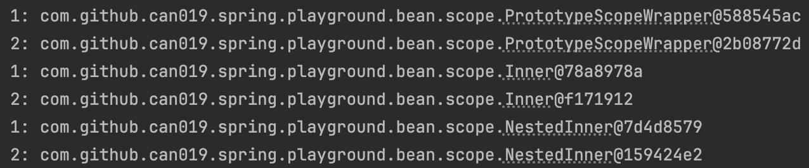
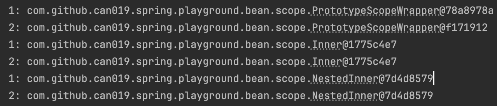

# Bean scope
## Singleton, Prototype
```
PrototypeWrapper (prototype)
└─ Inner (singleton)
    └─ NestedInner (prototype)
```
### 모두 Prototype인 경우
#### 깊은 복사 진행


### 중간 (Inner)가 singleton인 경우
#### Singleton을 만나면 그 아래가 singleton이어도 prototype으로 진행

